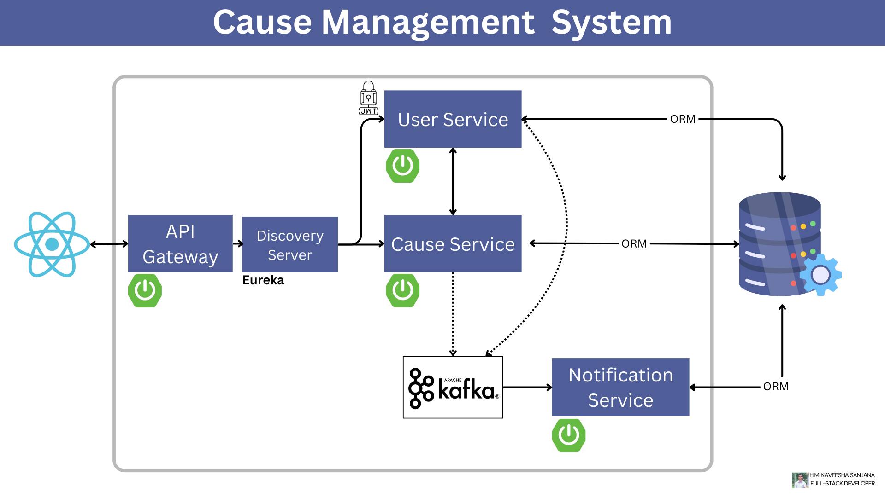
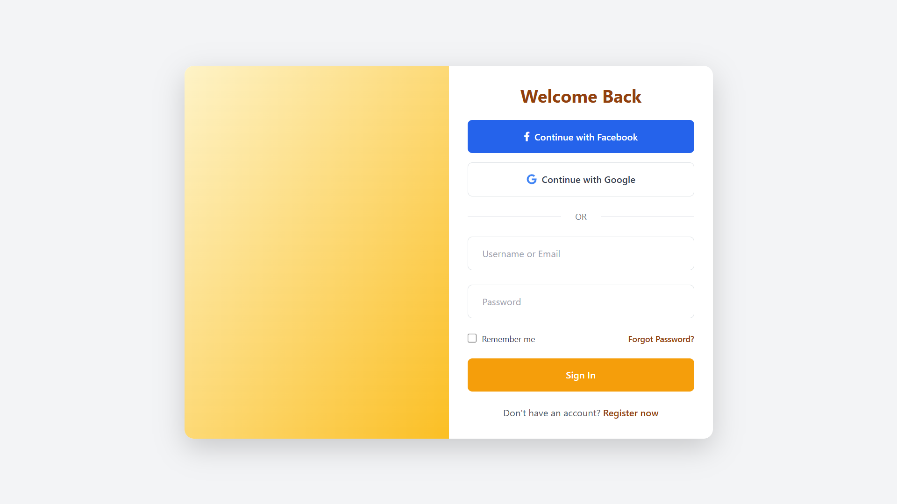
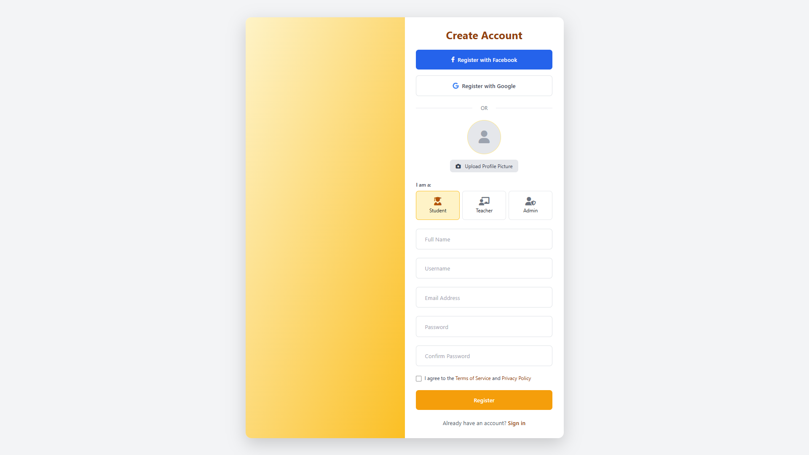
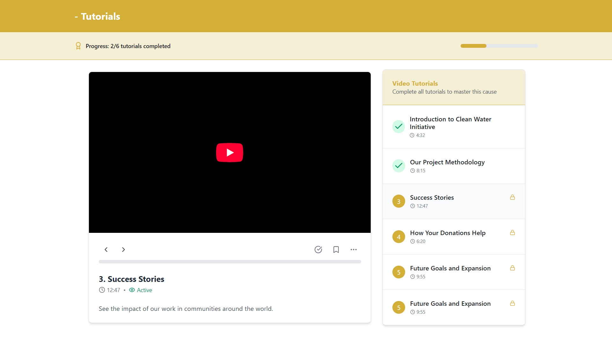
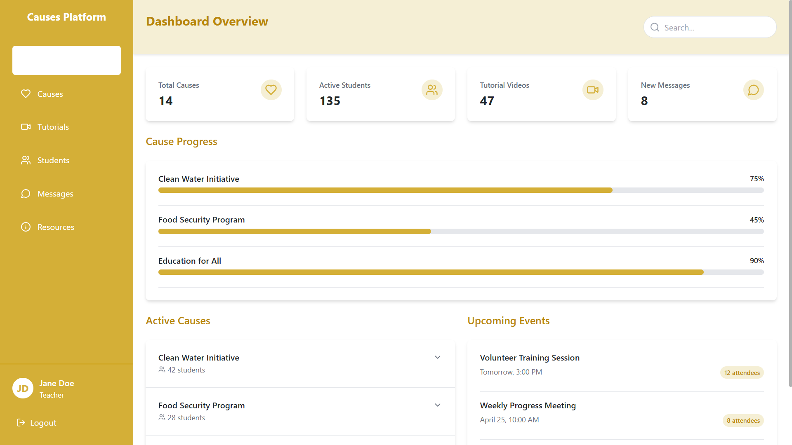

# Cause Management System

A modern web-based application designed to manage social causes with robust user authentication, dynamic business logic processing, and real-time notifications.

## 🛠️ Tech Stack

- **Frontend:** React.js
- **Backend:** Spring Boot Microservices
- **Authentication:** JWT & Google OAuth
- **Service Discovery:** Eureka
- **API Gateway:** Spring Cloud Gateway
- **Messaging:** Apache Kafka
- **Database Access:** ORM (Hibernate)
- **Notifications:** Jakarta Mail & Twilio
- **Emailing:** SMTP integration via Jakarta Mail

---

## 📦 Backend Microservices Overview

### 🔐 User Service
- Handles user registration, authentication, and authorization.
- Supports JWT-based sessions and Google OAuth login.
- Stores and manages user data securely.
- Exposes secure APIs for user-related operations.

### 📣 Cause Service
- Core business logic for managing causes.
- Supports YouTube link embedding to enrich cause content.
- CRUD operations on causes with Hibernate ORM.
- Interacts with the database and Kafka for updates and event publishing.

### 📬 Notification Service
- Sends real-time notifications via email and SMS.
- Powered by Jakarta Mail and Twilio.
- Consumes events from Apache Kafka to trigger alerts.

---

## 🖼️ Image Directory Structure

### Backend
- 

### Frontend
- 
- 
- 
- `

---

## 🔄 CRUD Support
- Full create, read, update, delete (CRUD) functionality available for all core entities (users, causes, notifications).

---

## 📈 Getting Started

1. Clone the repository
2. Set up backend microservices using Spring Boot and configure Eureka & Kafka
3. Launch the React frontend
4. Use the gateway to access and test APIs

---

## ✍️ Author
**H.M. Kaveesha Sanjana**  
*Full-Stack Developer*

---

## 📩 Contributions
Pull requests and issues are welcome. For major changes, please open an issue first to discuss what you would like to change.

